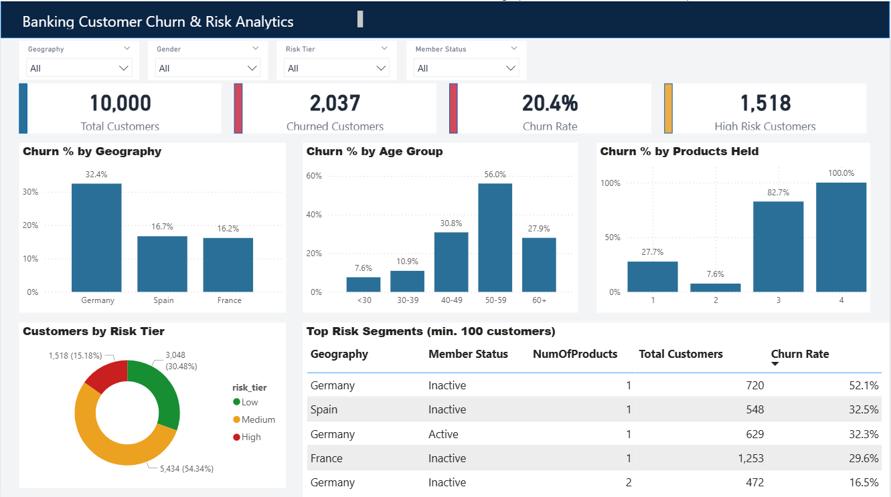

# Banking Customer Churn & Risk Analytics

End-to-end churn analysis of 10,000 bank customers using SQL, Python and Power BI.

## Problem
Which customers are leaving the bank, and which segments should a retention team prioritise?

## Dataset
Public Kaggle "Bank Customer Churn" dataset (`Churn_Modelling.csv`): 10,000 customers across France, Germany and Spain, 14 columns covering demographics, account details and churn status. Validated: 0 nulls, 0 duplicate customers.

## Approach
1. **SQL (PostgreSQL):** split raw data into `customers`, `accounts` and `activity` tables, built a `customer_360` view, and analysed churn with CTEs, CASE expressions and window functions (`sql_analysis.sql`).
2. **Python (Pandas, Seaborn):** EDA, feature bands (age group, tenure band) and cross-verification of the SQL results (`churn_modelling.ipynb`).
3. **Risk scoring:** rule-based score (age, products held, activity, geography) grouped into Low / Medium / High tiers.
4. **Power BI:** KPI cards, slicers and a 4-level drill-down: Geography > Age Group > Products > Member Status (`Bank_Churn_Dashboard.pbix`).

## Key Findings
- Overall churn: **20.4%** (2,037 of 10,000 customers).
- **Germany** churns at 32.4%, about 2x France and Spain (~16%).
- Churn peaks at **56.0%** for ages 50-59.
- **Inactive members churn at 26.9%** vs 14.3% for active members.
- 2-product customers are the safest (7.6%); 3-4 product customers churn at 82.7%-100% (small group of 326).
- Highest-risk segment: **Germany, inactive, 1 product**: 720 customers, 52.1% churn.
- **Tenure has almost no effect** (19-21% across all bands).

## Risk Tiers
| Tier | Customers | Churn rate |
|---|---|---|
| Low | 3,048 | 3.6% |
| Medium | 5,434 | 16.5% |
| High | 1,518 | 67.9% |

The High tier is 15% of customers but holds about half of all churners.

## Drill-down example (Germany)

## Retention Scenario (assumption, not a real campaign result)
If 25% of inactive customers behaved like active ones (14.3% churn), inactive-segment churn would fall from 26.9% to about 23.7%, a ~12% relative reduction. Sensitivity: 10% reactivation gives a 4.7% reduction, 50% gives 23.4%.

## Limitations
- Single snapshot, so no trend over time.
- Risk tiers were built and checked on the same data (in-sample); a train/test split is the next step.
- Scenario figures are assumptions, not observed campaign outcomes.

## Tools
PostgreSQL, Python (Pandas, NumPy, Matplotlib, Seaborn), Power BI, Google Colab
